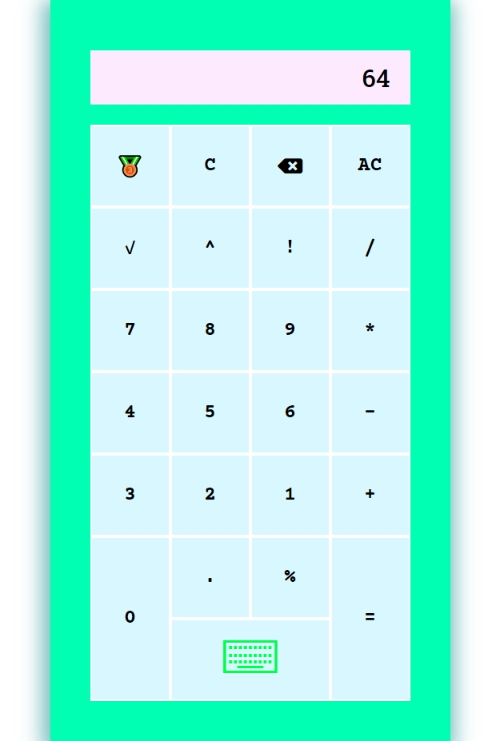

<h1 align="center">CALCULATOR</h1>

  <h3>
  <!--add netlify link here-->
    <a href="https://democalculators.netlify.app/">
      Live Demo
    </a>
  </h3>

<!-- TABLE OF CONTENTS -->

## Table of Contents

- [Overview](#overview)
- [Built With](#built-with)
- [Features](#features)
- [Contact](#contact)

<!-- OVERVIEW -->

## Overview

### Built With

- HTML5
- CSS custom properties
- CSS grid
- JAVASCRIPT
- RegExp
- JAVASCRIPT DOM API

## Features

This application/site was created as a project from [the odin project](https://www.theodinproject.com/). In this calculator you can calculate some basic mathematics.

## Contact

- GitHub [@coder71-bd](https://github.com/coder71-bd)
